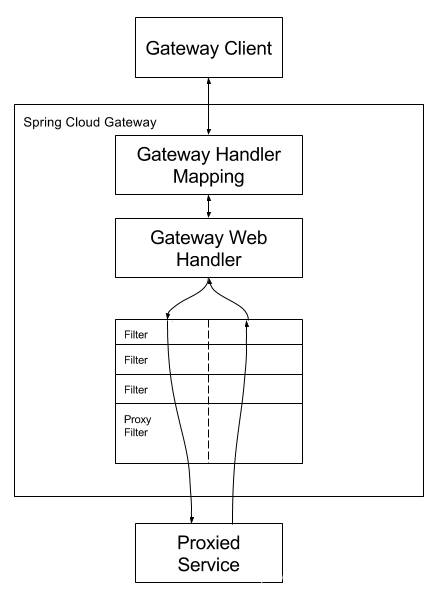
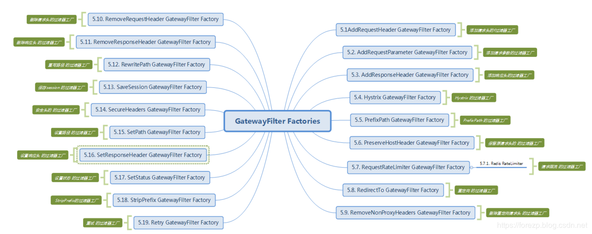

## spring-cloud-gateway
Spring Cloud Gateway是Spring Cloud官方推出的第二代网关框架，取代zuul网关。网关主要作用是路由转发、权限校验、限流控制。
### 入门
#### 一个简单的DEMO
创建一个项目gateway-first，添加Spring Cloud Gateway配置
```pom
       <dependency>
            <groupId>org.springframework.cloud</groupId>
            <artifactId>spring-cloud-starter-gateway</artifactId>
        </dependency>
```
注意不用加starer-web配置，因为Spring Cloud gateway已经包含了start-web
写一个Route路由
```java
@Configuration
public class FirstRoute {

    @Bean
    public RouteLocator firstRoutes(RouteLocatorBuilder builder){
        return builder.routes()
                .route(p -> p
                        .path("/get")
                        .filters(f -> f.addRequestHeader("Hello", "World"))
                        .uri("http://httpbin.org:80"))
                .build();
    }

}
```
路由的含义是"/get"路径下的请求都会添加上请求头，并且转发到地址http://httpbin.org:80，
启动项目，浏览器打开http://localhost:1111/get，浏览器返回
```json
{
  "args": {}, 
  "headers": {
    "Accept": "text/html,application/xhtml+xml,application/xml;q=0.9,image/webp,image/apng,*/*;q=0.8,application/signed-exchange;v=b3;q=0.9", 
    "Accept-Encoding": "gzip, deflate, br", 
    "Accept-Language": "zh-CN,zh;q=0.9", 
    "Content-Length": "0", 
    "Cookie": "last-serviceName=service-hi; token=uuc_token:UUC_TOKEN_1d5b43335-19d9-4acc-980d-36e066110f25", 
    "Forwarded": "proto=http;host=\"localhost:1111\";for=\"0:0:0:0:0:0:0:1:64521\"", 
    "Hello": "World", 
    "Host": "httpbin.org", 
    "Sec-Fetch-Dest": "document", 
    "Sec-Fetch-Mode": "navigate", 
    "Sec-Fetch-Site": "none", 
    "Sec-Fetch-User": "?1", 
    "Upgrade-Insecure-Requests": "1", 
    "User-Agent": "Mozilla/5.0 (Windows NT 10.0; Win64; x64) AppleWebKit/537.36 (KHTML, like Gecko) Chrome/83.0.4103.61 Safari/537.36", 
    "X-Amzn-Trace-Id": "Root=1-5ed60871-983f3ee03474c5c87c223d4c", 
    "X-Forwarded-Host": "localhost:1111"
  }, 
  "origin": "0:0:0:0:0:0:0:1, 116.227.75.54", 
  "url": "http://localhost:1111/get"
}
```
可见能正常访问目标地址，并且在请求头中添加了Hello:World
#### 使用Hystrix
路由当中可以直接使用Hystrix，首先引入jar包
```pom
        <!-- 断路器  -->
        <dependency>
            <groupId>org.springframework.cloud</groupId>
            <artifactId>spring-cloud-starter-netflix-hystrix</artifactId>
        </dependency>
```
路由中添加如下代码
```java

                .route(p -> p.
                        path("/hystrix")
                        .filters(f -> f
                                .hystrix(config -> config
                                        .setName("mycmd")
                                        .setFallbackUri("forward:/fallback")))  //访问失败后请求/fallback路径
                        .uri("http://httpbin.org:8000"))    //一个不可访问的地址
                .build();
```
再写一个fallback的请求
```java
    @RequestMapping("/fallback")
    public Mono<String> fallback(){
        return Mono.just("fallback");
    }
```
浏览器访问http://localhost:1111/hystrix，由于路由的是一个不可访问的地址，则会触发断路器去调用fallback请求，结果返回
```text
fallback
```
### 工作流程
请看官网的一张图



客户端向Spring Cloud Gateway发出请求。如果Gateway Handler Mapping确定请求与路由匹配（这个时候就用到了predicate）,则将其发送到Gateway web Handler处理。Gateway web Hanlder处理请求时会经过一系列的过滤器链。
过滤器链被虚线划分的原因是过滤器链可以在发送代理请求之前或之后执行。先执行所有“pre”过滤器，然后进行代理请求。在发出代理请求之后，收到代理服务器的响应之后执行“post”过滤器。这跟zuul的处理过程很类似。
在执行所有“pre”过滤器时，往往进行了鉴权、限流、日志输出等功能，以及请求头的更改、协议的转换；转发之后收到响应之后，会执行所有的“post”过滤器，在这里可以响应数据进行修改，比如响应头、协议的转换等。
在上面的处理过程中，请求和路由进行匹配会用到predicate，它决定了一个请求走哪个路由
### Predicate
介绍几种断言
#### Header Route Predicate Factory
这次我们直接使用配置的方式实现，新建一个工程gateway-two，引入gateway的包，加入配置
```yml
spring:
  cloud:
    gateway:
      routes:
        - id: s1
          uri: http://httpbin.org:80/get
          predicates:
            - Header=X-Request-Id, \d+
```
该配置表示，当请求的Header中有X-Request-Id的header名，且header值为数值时，请求会被路由到配置的uri，可以使用idea自带的REST Client工具给请求头添加值，可以测试效果
#### Cookie Route Predicate Factory
Cookie Route Predicate Factory需要两个名字参数，一个cookie的名字，一个值，可以为正则表达式，它用于匹配请求中，带有该名称的cookie和cookie能正则匹配的请求
我们新建一个配置文件application-s2.yml，修改application.yml中的active属性为s2，使s2文件生效，启动服务，然后在请求头中加入参数Cookie:name=forezp可看到效果
```yml
spring:
  cloud:
    gateway:
      routes:
        - id: s2
          uri: http://httpbin.org:80/get
          predicates:
            - Cookie=name, forezp
```
#### Host Route Predicate Factory
Host Route Predicate Factory需要一个参数即hostname，它可以使用.*等去匹配host。这个参数会匹配请求头中的host值，一致则请求正确转发,见配置application-host_route.yml
关于其它断言就不再一一列举了，用到的时候看官方文档
### filter
predict决定了请求哪一个路由处理，在路由处理之前，需要经过“pre”类型的过滤器，处理返回响应之后，可以由“post”类型的过滤器处理
filter的作用和生命周期
由filter工作流程点，可以知道filter有着非常重要的作用，在“pre”类型的过滤器可以做参数校验、权限校验、流量监控、日志输出、协议转换等，在“post”类型的过滤器可以做响应内容、响应头的修改、日志的输出、流量监控等。
Spring Cloud Gateway同zuul类似，有“pre”和“post”两种方式的filter。客户端请求先经过“pre”类型的filter，然后将请求转发到具体的业务服务，收到业务服务的响应之后，再经过“post”类型的filter处理，最后响应到客户端。
与zuul不同的是，filter除了分为“pre”和“post”两种方式外，在Spring Cloud Gateway中，filter的作用范围还可分为另外两种：一种是针对单个路由的gateway filter，它在配置文件中的写法同predict类似，另外一种是针对于所有
路由的global gateway filter
#### Gateway filter
过滤器允许以某种方式修改传入的HTTP请求或传出的HTTP响应。过滤器可以限定作用在某些特定的请求路径上，Spring Cloud Gateway包含许多内置的GatewayFilter工厂
GatewayFilter工厂和Predicate工厂类似，都是在配置文件application.yml中配置，遵循了约定大于配置的思想，只需要在配置文件配置GatewayFilter Factory的名称，而不需要写全类名，比如AddRequestHeaderGatewayFilterFactory
只需要在配置文件中写AddRequestHeader。
Spring Cloud Gateway内置的过滤器工厂一览表如下：
 
关于GatewayFilter的用法这里不再举例了，因为前面已经举过了，接下来看看自定义过滤器
##### 自定义过滤器
自定义过滤器需要实现GatewayFilter和Ordered两个接口，我们在gateway-first中写一个RequestTimeFIlter如下
```java
public class RequestTimeFilter implements GatewayFilter, Ordered {
    private static final Log log = LogFactory.getLog(GatewayFilter.class);
    private static final String REQUEST_TIME_BEGIN = "requestTimeBegin";
    @Override
    public Mono<Void> filter(ServerWebExchange exchange, GatewayFilterChain chain) {
        exchange.getAttributes().put(REQUEST_TIME_BEGIN, System.currentTimeMillis());
        return chain.filter(exchange).then(Mono.fromRunnable(() -> {
            Long startTime = exchange.getAttribute(REQUEST_TIME_BEGIN);
            if(startTime != null){
                log.info(exchange.getRequest().getURI().getRawPath() + ": " + (System.currentTimeMillis() - startTime) + "ms");
            }
        }));
    }

    // 过滤器优先级，值越大优先级越低
    @Override
    public int getOrder() {
        return 0;
    }
}
```
 这是一个自定义的过滤器用来打印服务请求处理的时间，那么我们需要把它加入到相应的路由工厂中，如下：
 ```java
    @Bean
    public RouteLocator customerRouteLocator(RouteLocatorBuilder builder){
        return builder.routes()
                .route(p -> p.
                        path("/customer/**")
                        .filters(f -> f.filter(new RequestTimeFilter())
                        .addResponseHeader("X-Response-Default-Foo", "Default-Bar"))
                        .uri("http://httpbin.org:80")
//                        .order(0)
//                        .id("customer_filter_router")
                )
                .build();
    }
```
启动服务，访问http://localhost:1111/customer，控制台打印
```text
2020-06-03 10:09:05.866  INFO 25552 --- [ctor-http-nio-1] o.s.cloud.gateway.filter.GatewayFilter   : /customer: 205ms
```
证明自定义过滤器生效
##### 自定义过滤器工厂
过滤器工厂的顶级接口是GatewayFilterFactory，我们可以直接继承它的两个抽象类来开发AbstractGatewayFilterFactory和AbstractNameValueGatewayFilterFactory，这两个抽象类的区别是前者接收一个参数，后者接收两个参数
现在需要自定义一个过滤器工厂，将请求日志打印出来，需要使用一个参数，我们参照RedirectToGatawayFilterFactory写法
```java
public class RequestTimeGatewayFilterFactory extends AbstractGatewayFilterFactory<RequestTimeGatewayFilterFactory.Config> {

    private static final Log log = LogFactory.getLog(GatewayFilter.class);
    private static final String REQUEST_TIME_BEGIN = "requestTimeBegin";
    private static final String KEY = "withParams";

    public List<String> shortcutFieldOrder() {
        return Arrays.asList("withParams");
    }

    public RequestTimeGatewayFilterFactory() {
        super(Config.class);
    }

    @Override
    public GatewayFilter apply(Config config) {
        return (exchange, chain) -> {
            exchange.getAttributes().put(REQUEST_TIME_BEGIN, System.currentTimeMillis());
            return chain.filter(exchange).then(
                    Mono.fromRunnable(() -> {
                        Long startTime = exchange.getAttribute(REQUEST_TIME_BEGIN);
                        if (startTime != null) {
                            StringBuilder sb = new StringBuilder(exchange.getRequest().getURI().getRawPath())
                                    .append(": ")
                                    .append(System.currentTimeMillis() - startTime)
                                    .append("ms");
                            if (config.isWithParams()) {
                                sb.append(" params:").append(exchange.getRequest().getQueryParams());
                            }
                            log.info(sb.toString());
                        }
                    })
            );
        };
    }

    public static class Config{
        private boolean withParams;

        public boolean isWithParams() {
            return withParams;
        }

        public void setWithParams(boolean withParams) {
            this.withParams = withParams;
        }
    }

}
```
然后需要将此自定义的过滤器工厂加入Spring管理，可直接在类上加注解@@Component，也可以定义成一个Bean放入配置类中
```java
    @Bean
    public RequestTimeGatewayFilterFactory elapsedGatewayFilterFactory() {
        return new RequestTimeGatewayFilterFactory();
    }
```
然后加个配置测试下该类
```yml
server:
  port: 1112
spring:
  cloud:
    gateway:
      routes:
        - id: elapse_route
          uri: http://httpbin.org:80/get
          filters:
            - RequestTime=false
          predicates:
            - After=2017-01-20T17:42:47.789-07:00[America/Denver]
```
浏览器访问地址，本地会打印出请求的时间，证明配置成功
#### Global Filter
Spring Cloud Gateway根据作用范围划分为GatewayFilter和GlobalFilter，二者区别如下：
    GatewayFilter:需要通过spring.cloud.routes.filters配置在具体的路由下，只作用在当前路由上或通过spring.cloud.default-filter配置在全局，作用在所有路由上
    GlobalFilter:全局过滤器，不需要在文件中配置，作用在所有的路由上，最终通过GatewayFilterAdapter包装成GatewayFilterChain可识别的过滤器，它为请求业务及路由的URI转换为真实业务服务的请求地址的核心过滤器，系统初始化时加载，并作用在每个路由上
Spring Cloud Gateway框架内置的GlobalFilter如下

图中每一个GlobalFilter都作用在每一个router上，能够满足大多数需求，但是如果遇到业务上的定制，可能需要自己编写GlobalFilter。
##### 自定义全局过滤器
编写自己的GlobalFilter，该GlobalFilter会校验请求中是否包含了请求参数“token”，如果不包含，则不转发路由
```java
@Component
public class TokenFilter implements GlobalFilter, Ordered {
    Logger logger= LoggerFactory.getLogger( TokenFilter.class );
    @Override
    public Mono<Void> filter(ServerWebExchange exchange, GatewayFilterChain chain) {
        String token = exchange.getRequest().getQueryParams().getFirst("token");
        if(token == null || token.isEmpty()){
            logger.info("token is empty...");
            exchange.getResponse().setStatusCode(HttpStatus.UNAUTHORIZED);
            return exchange.getResponse().setComplete();
        }
        return chain.filter(exchange);
    }

    @Override
    public int getOrder() {
        return -100;
    }
}
```
启动工程，访问，控制台打印
```text
token is empty...
```
自定义全局过滤器生效
### 限流
在高并发的系统中，往往需要在系统中做限流，一方面为了防止大量的请求使服务器过载，导致服务器不可用，另一方面是为了防止网络攻击。
常见的限流方式，比如Hystrix使用线程池隔离，超过线程池的负载，走熔断逻辑。在一般应用服务器中，比如tomcat容器也是通过限制它的线程数来控制并发的；也有通过时间窗口的平均速度来控制流量。常见的限流维度比如通过ip来限流、通过uri来限流、通用用户访问频率来限流
一般限流都是在网关这一层做，比如Nginx、Openresty、kong、zuul、Spring Cloud Gateway等；也可以在应用层通过AOP来限流
#### 常见的限流算法
##### 计数器法
计算器法采用计数器实现，一般我们会限制一秒钟的能够通过的请求数，比如限流qps为100，算法的实现思路是从第一个请求进来开始计时，在接下去的1s内，每一个请求都把计数器+1，如果累加到100，那么后续的请求全部拒绝。等到1s结束后，把计数器恢复成0，重新开始计数。
##### 漏桶算法
漏桶算法是为了消除“突刺现象”，可以采用漏桶算法实现限流，漏桶算法这个名字就很形象，算法内部有一个容器，类似生活中用的漏斗，当请求进来时，相当于水倒入漏斗，然后从下端小口慢慢均速的流出。不管上面流量有多大，下面流出的速度始终不变。不管服务调用方多么地不稳定，通过漏斗算法进行限流，每10ms处理一次请求
因为处理的速度是未知的，可能进来很多请求，没来得及处理的请求就先放在桶里，既然是个桶，肯定有上限的，如果桶满了，那么新进来的请求就丢弃
##### 令牌桶算法
从某种意义来讲，令牌桶算法是漏桶算法的一种改进，桶算法能够限制请求调用的频率，而令牌桶算法能够在限制调用的平均速率的同时还允许有一定程度的突发调用。在令牌桶算法中，存在一个桶，用来存放固定数量的令牌。算法中存在一种机制，以一定的速率往桶中放令牌。每次请求调用需要先获取令牌，只有拿到令牌，才有机会执行，否则选择等待可用的令牌、或者直接拒绝。放令牌这个动作是持续不断进行的，如果桶中的令牌达上限，就丢弃令牌
所以存在这种情况，桶中一直有大量可用令牌，这时进来的请求就可以直接拿到令牌执行，比如设置qps为100，那么限流器初始化完成1s后，桶中就有100个令牌了，这时服务还没完全启动好，等启动完成对外提供服务时，该限流器可以抵挡瞬时的100个请求，所以，只有桶中没有令牌时，请求才会进行等待，最后相当于以一定的速率执行
#### Spring Cloud Gateway限流
限流作为网关基本功能，Spring Cloud Gateway官方提供了RequestRateLimiterGatewayFilterFactory，适用Redis和lua脚本实现了令牌桶方式，lua脚本在spring-cloud-gateway-core中的request_rate_limiter.lua文件中
使用方法，首先在pom文件中引入gateway的起步依赖和redis的reactive依赖
新建一个工程gateway-limiter，相关配置可见代码
### Spring Cloud Gateway服务注册与发现
//TODO 
涉及工程：discovery-eureka-server、gateway-discovery-eureka、service-hi，示例中还有问题，好像不能正确访问service-hi，待我慢慢查明原因


